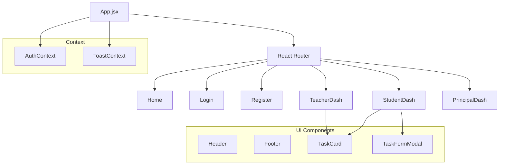
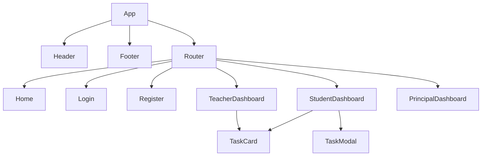

# StudyTrackr Frontend

Complete frontend documentation for the StudyTrackr task management system built with React and Tailwind CSS.

## 📋 Overview

The StudyTrackr frontend is a modern, responsive Single Page Application (SPA) built with React 19, Vite, and Tailwind CSS. It provides an intuitive user interface for students, teachers, and principals to manage tasks with role-based access control.

## 🏗️ Project Structure

```
client/
├── public/
│   ├── assets/              # Static images (hero, features, etc.)
│   │   ├── hero.png
│   │   ├── feature1.png
│   │   ├── feature2.png
│   │   ├── feature_section_1.png
│   │   └── featurepage_2.png
│   └── welcome-bg.png       # Welcome screen background
│
├── src/
│   ├── components/          # Reusable UI components
│   │   ├── Footer.jsx       # Global footer component
│   │   ├── Header.jsx       # Navigation bar with role-based links
│   │   ├── LoadingSpinner.jsx # Loading indicator
│   │   ├── Modal.jsx        # Modal dialog wrapper
│   │   ├── PrivateRoute.jsx # Route protection (basic)
│   │   ├── PrivateRouteRole.jsx # Role-based route protection
│   │   ├── ScrollToTop.jsx  # Scroll to top on route change
│   │   ├── TaskCard.jsx     # Task card component (legacy)
│   │   ├── TaskForm.jsx     # Task creation/editing form
│   │   ├── TaskList.jsx     # Task list component (legacy)
│   │   └── Toast.jsx        # Toast notification component
│   │
│   ├── context/             # React Context providers
│   │   ├── AuthContext.jsx  # Authentication state management
│   │   └── ToastContext.jsx # Global toast notifications
│   │
│   ├── pages/               # Page components
│   │   ├── WelcomeScreen.jsx # Splash screen with typewriter
│   │   ├── Home.jsx         # Landing page
│   │   ├── Features.jsx     # Features showcase page
│   │   ├── Pricing.jsx      # Pricing plans page
│   │   ├── Contact.jsx      # Contact information page
│   │   ├── Login.jsx        # Login page
│   │   ├── Register.jsx     # Registration page
│   │   ├── StudentDashboard.jsx # Student task dashboard
│   │   ├── TeacherDashboard.jsx # Teacher task dashboard
│   │   ├── PrincipalLogin.jsx # Principal login page
│   │   ├── PrincipalManageTeachers.jsx # Principal dashboard
│   │   └── Dashboard.jsx    # Legacy dashboard (fallback)
│   │
│   ├── services/            # API service layer
│   │   ├── api.js           # Axios instance & interceptors
│   │   ├── auth.js          # Authentication API calls
│   │   ├── task.js          # Task API calls
│   │   ├── teacher.js       # Teacher API calls
│   │   └── principal.js     # Principal API calls
│   │
│   ├── styles/              # Global styles & theme
│   │   ├── global.css       # Global CSS resets
│   │   └── theme.css        # Custom Tailwind theme
│   │
│   ├── App.jsx              # Main app component & routing
│   ├── App.css              # App-specific styles
│   ├── index.css            # Tailwind directives & animations
│   └── main.jsx             # Application entry point
│
├── index.html               # HTML template
├── vite.config.js           # Vite configuration
├── tailwind.config.js       # Tailwind CSS configuration
└── package.json
```

### Frontend Architecture Flow



### Component Hierarchy



## 🛠️ Technology Stack

- **React 19** - UI library
- **Vite 7** - Build tool and dev server
- **Tailwind CSS 4** - Utility-first CSS framework
- **React Router DOM 7** - Client-side routing
- **Axios** - HTTP client for API requests
- **React Context API** - State management (Auth, Toast)
- **Typewriter Effect** - Welcome screen animation

## 🚀 Setup Instructions

### 1. Install Dependencies

```bash
cd client
npm install
```

### 2. Environment Variables (Optional)

Create a `.env` file in the `client/` directory if using a custom API URL:

```env
VITE_API_URL=http://localhost:5000/api
```

**Note:** Default API URL is `http://localhost:5000/api` (configured in `src/services/api.js`).

### 3. Start Development Server

```bash
npm run dev
```

The frontend will start on `http://localhost:5173` (or next available port).

### 4. Build for Production

```bash
npm run build
```

Built files will be in the `dist/` directory.

### 5. Preview Production Build

```bash
npm run preview
```

## 🔐 Authentication Context

### AuthContext Overview

**Location:** `src/context/AuthContext.jsx`

The `AuthContext` provides global authentication state management across the entire application.

### Features

- **Token Management:**
  - Stores JWT token in `localStorage`
  - Automatically attaches token to API requests
  - Removes token on logout

- **User State:**
  - Stores user object in `localStorage`
  - Persists user data across page refreshes
  - Provides user role, ID, name, email, and teacher info (for students)

- **Authentication State:**
  - `isAuthenticated`: Boolean indicating if user is logged in
  - `isInitializing`: Boolean indicating if auth state is being restored

### Usage

```javascript
import { useAuth } from '../context/AuthContext';

function MyComponent() {
  const { user, token, isAuthenticated, setUser, setToken } = useAuth();

  // Access user data
  console.log(user.name, user.role);

  // Check authentication
  if (isAuthenticated) {
    // Show authenticated content
  }
}
```

### Token Storage

**Location:** `src/services/api.js`

- Token stored in `localStorage` with key `'token'`
- Automatically added to `Authorization: Bearer <token>` header
- Removed from storage on logout or token expiration (401 response)

### User Persistence

- User object stored in `localStorage` with key `'user'`
- Restored on page load to prevent redirects
- Includes: `id`, `name`, `email`, `role`, `teacherId`, `teacherInfo`

## 🔀 Role-Based Routing

### Route Protection

**Location:** `src/components/PrivateRouteRole.jsx`

Routes are protected based on user role using `PrivateRouteRole` component:

```javascript
<Route
  path="/student/dashboard"
  element={
    <PrivateRouteRole allowedRoles={['student']}>
      <StudentDashboard />
    </PrivateRouteRole>
  }
/>
```

### Role-Based Redirection

**Login Flow:**
- After login, user is redirected based on role:
  - `student` → `/student/dashboard`
  - `teacher` → `/teacher/dashboard`
  - `principal` → `/principal/teachers`

**Location:** `src/pages/Login.jsx` (lines 56-64)

**Implementation:**
```javascript
if (response.user.role === 'student') {
  navigate('/student/dashboard');
} else if (response.user.role === 'teacher') {
  navigate('/teacher/dashboard');
} else if (response.user.role === 'principal') {
  navigate('/principal/teachers');
}
```

### Route Structure

**Public Routes:**
- `/` - Welcome screen
- `/home` - Landing page
- `/features` - Features page
- `/pricing` - Pricing page
- `/contact` - Contact page
- `/login` - Login page
- `/register` - Registration page

**Protected Routes:**
- `/student/dashboard` - Student dashboard (role: `student`)
- `/teacher/dashboard` - Teacher dashboard (role: `teacher`)
- `/principal/teachers` - Principal dashboard (role: `principal`)
- `/dashboard` - Legacy fallback dashboard

## 📄 Pages Documentation

### Welcome Screen

**Location:** `src/pages/WelcomeScreen.jsx`

- Full-screen splash screen with blurred background image
- Typewriter animation displaying "Welcome to StudyTrackr"
- Auto-redirects to `/home` after 5 seconds
- Fade-out animation before redirect

### Home Page

**Location:** `src/pages/Home.jsx`

**Features:**
- Hero section with CTA button
- Feature sections with alternating layouts
- Benefits grid (3-4 cards)
- Stats/metrics section
- "How It Works" section (3 steps)
- Testimonials section
- Final CTA section

**Design:** Modern SaaS-style landing page with responsive layout.

### Features Page

**Location:** `src/pages/Features.jsx`

**Features:**
- Hero section
- Main features grid (6 features)
- Split feature sections with images
- CTA section

**Features Highlighted:**
1. Student Task Management
2. Teacher Task Monitoring
3. Role-Based Access Control
4. Secure Authentication
5. Principal Management Tools (Optional)
6. Progress Tracking

### Pricing Page

**Location:** `src/pages/Pricing.jsx`

**Features:**
- Three pricing plans:
  - Free Plan (Students)
  - Teacher Plan
  - Institutional Plan (Principals - Optional)
- Feature comparison
- CTA buttons

### Contact Page

**Location:** `src/pages/Contact.jsx`

**Features:**
- Contact details section (email, phone, address, LinkedIn)
- Contact form (name, email, subject, message)
- Two-column layout on desktop, stacked on mobile

### Login Page

**Location:** `src/pages/Login.jsx`

**Features:**
- Email and password inputs
- Password visibility toggle (eye icon)
- Form validation
- Error handling
- Redirects based on role after login
- Link to registration page
- Subtle gradient background

**Validation:**
- Email format validation
- Password presence check
- Minimum password length (6 characters)

### Register Page

**Location:** `src/pages/Register.jsx`

**Features:**
- Name, email, password inputs
- Role selector (student/teacher)
- Conditional `teacherId` dropdown (shown only for students)
- Password visibility toggle
- Form validation
- Automatic login after registration
- Subtle gradient background

**Key Logic:**
- When role is `'student'`, fetches teachers from `/api/teachers`
- Displays teacher dropdown with name and email
- Validates `teacherId` is selected for students
- Submits registration with appropriate payload

### Student Dashboard

**Location:** `src/pages/StudentDashboard.jsx`

**Features:**
- **Header:** Welcome message with student name and assigned teacher name
- **Stats Cards:**
  - Total Tasks
  - Completed Tasks
  - In Progress Tasks
  - Not Started Tasks
- **Task Filter:** Filter by progress (all, not-started, in-progress, completed)
- **Task Grid:** Responsive grid displaying task cards
- **Task Actions:**
  - Create task (opens modal with TaskForm)
  - Update progress (dropdown on each task)
  - Delete task (with confirmation)
- **Empty State:** Message when no tasks are available

**Key Features:**
- Displays only student's own tasks (backend filtering)
- Shows teacher name or ID
- Real-time task updates
- Toast notifications for actions

### Teacher Dashboard

**Location:** `src/pages/TeacherDashboard.jsx`

**Features:**
- **Header:** Welcome message with assigned students count
- **Assigned Students List:** Displays names and emails of assigned students
- **Stats Cards:**
  - Your Tasks count
  - Student Tasks count
  - Completed, In Progress, Not Started counts
- **Task Filters:**
  - Filter by ownership (All, Your Tasks, Student Tasks)
  - Filter by progress (All, Not Started, In Progress, Completed)
- **Task Grid:** Displays both teacher's own tasks and student tasks
- **Visual Differentiation:**
  - Own tasks: Turquoise border
  - Student tasks: Orange border
  - Creator label on each task
- **Task Actions:**
  - Create task (teacher's own)
  - Update progress (own tasks only)
  - Delete task (own tasks only)
  - Student tasks are read-only

**Key Features:**
- Shows tasks from assigned students (read-only)
- Cannot modify or delete student tasks
- Separates own tasks from student tasks visually
- Fetches assigned students list from `/api/teacher/students`

### Principal Dashboard (Optional Feature)

**Location:** `src/pages/PrincipalManageTeachers.jsx`

**Features:**
- View all teachers in the system
- Create new teacher accounts
- Delete teacher accounts
- Teacher list with name, email, and creation date

**Note:** This is an optional feature not required by the assignment.

## 🔌 API Integration

### API Service Layer

**Location:** `src/services/`

### Axios Configuration

**File:** `src/services/api.js`

**Features:**
- Base URL: `http://localhost:5000/api`
- Request interceptor: Automatically adds `Authorization: Bearer <token>` header
- Response interceptor: Handles 401 (auto-logout) and 403 (forbidden) errors
- Token management: `getToken()`, `setToken()`, `removeToken()`

### Service Files

1. **`auth.js`** - Authentication services
   - `signup(userData)` - Register new user
   - `login(email, password)` - Authenticate user
   - `logout()` - Clear token from storage

2. **`task.js`** - Task services
   - `getTasks()` - Fetch tasks (role-filtered)
   - `createTask(taskData)` - Create new task
   - `updateTask(taskId, taskData)` - Update task
   - `deleteTask(taskId)` - Delete task

3. **`teacher.js`** - Teacher services
   - `getAssignedStudents()` - Get students assigned to teacher

4. **`principal.js`** - Principal services
   - `createTeacher(teacherData)` - Create teacher account
   - `getTeachers()` - Get all teachers
   - `deleteTeacher(teacherId)` - Delete teacher account

### Error Handling

**Location:** `src/services/api.js` (response interceptor)

- **401 Unauthorized:** Auto-logout and redirect to login
- **403 Forbidden:** Show error toast notification
- All errors: Propagated to components for display

## 🎨 Styling & Theme

### Tailwind CSS Configuration

**File:** `tailwind.config.js`

**Custom Colors:**
- `turquoise`: `#5ce3d4` (Primary brand color)
- `orange`: `#ff914d` (Secondary action color)
- `black`: `#000000` (Text color)

### Theme Customization

**File:** `src/styles/theme.css`

**Custom Classes:**
- `.btn-primary` - Primary button style (orange background)
- `.input` - Input field style
- `.card` - Card container style

### Global Styles

**File:** `src/index.css`

**Features:**
- Tailwind directives (`@import "tailwindcss"`)
- Custom animations (fade, fade-in-up, fade-in-left, fade-in-right)
- Image hover effects
- Global resets

### Responsive Design

- Mobile-first approach
- Breakpoints: `sm:`, `md:`, `lg:`
- Responsive grid layouts
- Mobile menu with slide animation

## 🔔 Toast Notifications

**Location:** `src/context/ToastContext.jsx`

**Features:**
- Global toast notification system
- Success and error toasts
- Auto-dismiss after 3 seconds
- Position: Top-right corner

**Usage:**
```javascript
import { useToast } from '../context/ToastContext';

function MyComponent() {
  const { showSuccess, showError } = useToast();

  const handleSuccess = () => {
    showSuccess('Task created successfully!');
  };

  const handleError = () => {
    showError('Failed to create task');
  };
}
```

## 🧪 Component Details

### Modal Component

**Location:** `src/components/Modal.jsx`

**Features:**
- Reusable modal dialog
- Click outside to close
- ESC key to close
- Customizable title and content

**Usage:**
```javascript
<Modal isOpen={showModal} onClose={() => setShowModal(false)} title="Create Task">
  <TaskForm onSubmit={handleSubmit} onCancel={() => setShowModal(false)} />
</Modal>
```

### TaskForm Component

**Location:** `src/components/TaskForm.jsx`

**Fields:**
- Title (required)
- Description (optional)
- Due Date (optional, date picker)
- Progress (dropdown: not-started, in-progress, completed)

**Features:**
- Form validation
- Loading state
- Submit and cancel buttons

### LoadingSpinner Component

**Location:** `src/components/LoadingSpinner.jsx`

**Usage:** Displays during API requests and page initialization.

### ScrollToTop Component

**Location:** `src/components/ScrollToTop.jsx`

**Features:**
- Automatically scrolls to top on route change
- Ensures users see content from the beginning on navigation

## 📸 Screenshots

_Placeholder for frontend screenshots:_

- Welcome Screen with Typewriter Animation
- Home Page Hero Section
- Student Dashboard with Task Grid
- Teacher Dashboard with Student Tasks
- Login/Register Pages
- Mobile Responsive Views
- Toast Notifications
- Task Creation Modal

## 🔍 Troubleshooting

### Issue: API requests failing with CORS error
**Solution:** Ensure backend CORS is configured to allow `http://localhost:5173`

### Issue: Token not persisting after page refresh
**Solution:** Check browser localStorage is enabled. Token is stored in `localStorage` with key `'token'`.

### Issue: Redirect loop after login
**Solution:** Verify `AuthContext` is properly initialized. Check `isInitializing` state in `PrivateRouteRole`.

### Issue: Teacher dropdown not populating
**Solution:** Ensure backend `/api/teachers` endpoint is accessible (public route). Check browser console for errors.

### Issue: Student tasks not showing on Teacher Dashboard
**Solution:** Verify student has `teacherId` set correctly. Check backend filtering logic in `taskController.js`.

## 🚀 Deployment

### Build for Production

```bash
npm run build
```

### Environment Variables for Production

Set `VITE_API_URL` to your production API URL:

```env
VITE_API_URL=https://api.yourdomain.com/api
```

### Deploy to Vercel/Netlify

1. Build the project: `npm run build`
2. Deploy the `dist/` directory
3. Configure environment variables in hosting platform
4. Update API URL in production

## 📝 Notes

- All API calls use Axios interceptors for automatic token attachment
- User data is persisted in `localStorage` to prevent redirects on refresh
- Role-based routing ensures users can only access authorized pages
- Toast notifications provide immediate feedback for all user actions
- Responsive design ensures the app works on all screen sizes

---

**Frontend Documentation** | Part of StudyTrackr MERN Stack
