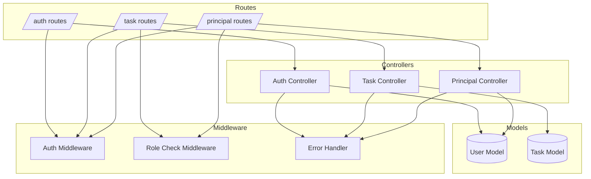
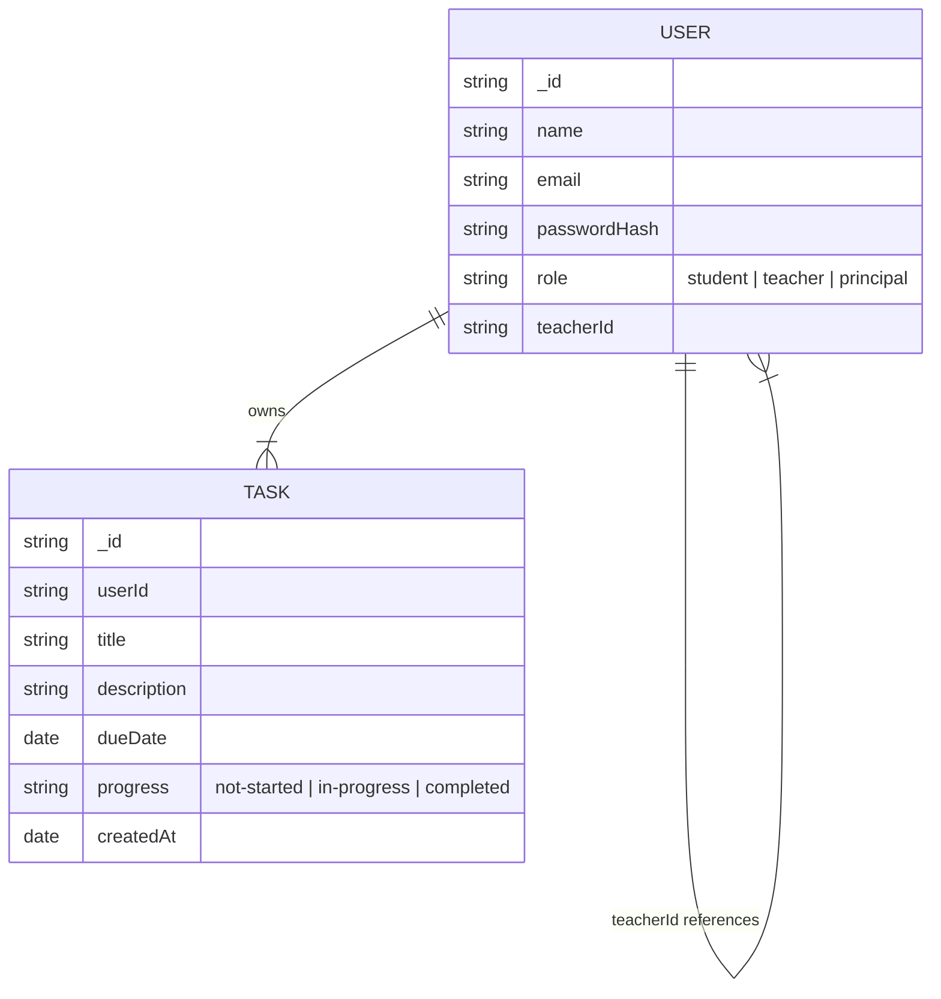
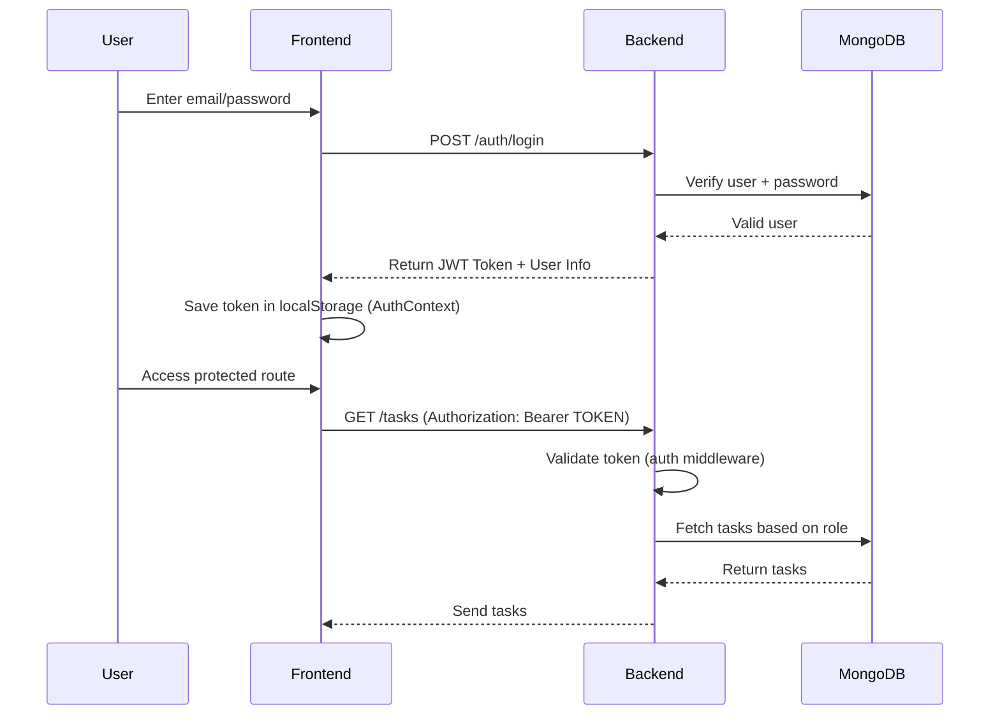
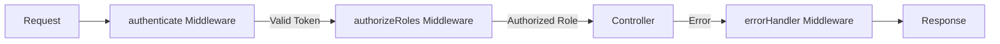

# StudyTrackr Backend

Complete backend API documentation for the StudyTrackr task management system.

## 📋 Overview

The StudyTrackr backend is built with Node.js and Express.js, following MVC architecture principles. It provides a RESTful API for task management with role-based access control (RBAC) for students, teachers, and principals.

## 🏗️ Architecture

### Folder Structure

```
server/
├── src/
│   ├── config/
│   │   └── db.js                 # MongoDB connection configuration
│   │
│   ├── controllers/
│   │   ├── authController.js     # Authentication logic (signup, login)
│   │   ├── taskController.js     # Task CRUD operations
│   │   ├── userController.js     # Public user endpoints
│   │   ├── teacherController.js  # Teacher-specific endpoints
│   │   └── principalController.js # Principal endpoints (optional)
│   │
│   ├── middlewares/
│   │   ├── authMiddleware.js     # JWT authentication & role authorization
│   │   └── errorMiddleware.js    # Global error handler
│   │
│   ├── models/
│   │   ├── User.js               # User schema (student, teacher, principal)
│   │   └── Task.js               # Task schema
│   │
│   ├── routes/
│   │   ├── index.js              # Main router
│   │   ├── authRoutes.js         # Authentication routes
│   │   ├── taskRoutes.js         # Task routes (protected)
│   │   ├── userRoutes.js         # Public user routes
│   │   ├── teacherRoutes.js      # Teacher routes
│   │   └── principalRoutes.js    # Principal routes (optional)
│   │
│   ├── utils/
│   │   ├── constants.js          # Role & progress constants
│   │   └── validators/
│   │       ├── authValidators.js    # Auth input validation
│   │       ├── taskValidators.js    # Task input validation
│   │       └── principalValidators.js # Principal validation
│   │
│   └── index.js                  # Application entry point
│
├── .env.example                  # Environment variables template
└── package.json
```

### Backend Architecture Flow



## 🛠️ Technology Stack

- **Node.js** - JavaScript runtime
- **Express.js 5** - Web application framework
- **MongoDB** - NoSQL database
- **Mongoose 8** - MongoDB object modeling
- **JWT (jsonwebtoken)** - Authentication tokens
- **bcrypt** - Password hashing
- **express-validator** - Input validation middleware
- **dotenv** - Environment variable management
- **cors** - Cross-origin resource sharing

## 🚀 Setup Instructions

### 1. Install Dependencies

```bash
cd server
npm install
```

### 2. Environment Variables

Create a `.env` file in the `server/` directory:

```env
MONGO_URI=mongodb://localhost:27017/studytrackr
JWT_SECRET=your-super-secret-jwt-key-minimum-32-characters
PORT=5000
NODE_ENV=development
```

**Generate a secure JWT secret:**
```bash
node -e "console.log(require('crypto').randomBytes(32).toString('hex'))"
```

### 3. Start MongoDB

**Local MongoDB:**
```bash
mongod
```

**Or use MongoDB Atlas** and update `MONGO_URI` with your connection string.

### 4. Run the Server

```bash
# Development mode (with auto-reload)
npm run dev

# Production mode
npm start
```

The server will start on `http://localhost:5000` (or the port specified in `.env`).

## 📊 Database Schemas

### ER Diagram



### User Model

```javascript
{
  name: String (required, trimmed)
  email: String (required, unique, lowercase, trimmed)
  passwordHash: String (required) // Hashed with bcrypt
  role: String (required, enum: ['student', 'teacher', 'principal'])
  teacherId: ObjectId (required IF role === 'student', ref: 'User')
  createdAt: Date (auto-generated)
  updatedAt: Date (auto-generated)
}
```

**Key Points:**
- `teacherId` is **conditionally required**: Only for students
- `teacherId` references a `User` document with `role: 'teacher'`
- Passwords are hashed using bcrypt with 10 salt rounds
- Email must be unique across all users

### Task Model

```javascript
{
  userId: ObjectId (required, ref: 'User')
  title: String (required, trimmed)
  description: String (optional, trimmed)
  dueDate: Date (optional)
  progress: String (required, enum: ['not-started', 'in-progress', 'completed'], default: 'not-started')
  createdAt: Date (auto-generated)
  updatedAt: Date (auto-generated)
}
```

**Key Points:**
- `userId` is automatically set to the logged-in user's ID (cannot be changed)
- `progress` has three states: `'not-started'`, `'in-progress'`, `'completed'`
- Tasks are sorted by `createdAt` in descending order (newest first)

## 🔐 Authentication Flow

### JWT Flow Diagram



### JWT Token Generation

1. User signs up or logs in
2. Server validates credentials
3. Server generates JWT token with payload:
   ```javascript
   {
     id: user._id,
     role: user.role
   }
   ```
4. Token expires in 7 days
5. Token is sent to client in response

### Token Usage

All protected routes require the JWT token in the `Authorization` header:

```
Authorization: Bearer <token>
```

### Middleware Chain



## 🛡️ Middleware

### Authentication Middleware (`authenticate`)

**Location:** `src/middlewares/authMiddleware.js`

**Function:**
- Extracts JWT token from `Authorization: Bearer <token>` header
- Verifies token signature using `JWT_SECRET`
- Decodes token and attaches `user` object to `req.user`
- Returns 401 if token is missing or invalid

**Usage:**
```javascript
router.use(authenticate);
```

### Authorization Middleware (`authorizeRoles`)

**Location:** `src/middlewares/authMiddleware.js`

**Function:**
- Checks if `req.user.role` is in the list of allowed roles
- Returns 403 if user role is not authorized

**Usage:**
```javascript
router.use(authorizeRoles('student', 'teacher'));
```

### Error Handler Middleware (`errorHandler`)

**Location:** `src/middlewares/errorMiddleware.js`

**Function:**
- Catches all errors from controllers
- Formats errors consistently: `{ success: false, message: "..." }`
- Sets appropriate HTTP status codes
- Logs errors for debugging

## 👥 Student–Teacher Relationship

### Relationship Model

- **Student** → Has `teacherId` field (references a Teacher)
- **Teacher** → Can have multiple students (students have `teacherId` pointing to teacher)

### Task Access Logic

**For Teachers:**
```javascript
// Build filter to get:
// 1. Teacher's own tasks (userId === teacherId)
// 2. Tasks from assigned students (userId IN [assignedStudentIds])

const assignedStudents = await User.find({ teacherId, role: 'student' });
const studentIds = assignedStudents.map(s => s._id);

filter = {
  $or: [
    { userId: teacherId },           // Own tasks
    { userId: { $in: studentIds } }  // Student tasks
  ]
};
```

**For Students:**
```javascript
// Only their own tasks
filter = { userId: studentId };
```

### Task Modification Rules

- **Students:** Can only update/delete their own tasks
- **Teachers:** Can only update/delete tasks they created (not student tasks)
- **Principals:** Cannot access task endpoints

**Implementation:** `ensureCanMutateTask()` function checks ownership before allowing updates/deletes.

## 🔌 API Endpoints

### Base URL

```
http://localhost:5000/api
```

### Authentication Endpoints

#### POST `/auth/signup`

Register a new user.

**Request Body:**
```json
{
  "name": "John Doe",
  "email": "john@example.com",
  "password": "password123",
  "role": "student",
  "teacherId": "507f1f77bcf86cd799439011" // Required if role is "student"
}
```

**Validation:**
- `name`: Required, trimmed
- `email`: Required, valid email format, unique
- `password`: Required, minimum 6 characters
- `role`: Required, must be one of: `['student', 'teacher', 'principal']`
- `teacherId`: Required if `role === 'student'`, must be valid MongoDB ObjectId

**Response (201 Created):**
```json
{
  "success": true,
  "message": "User registered successfully",
  "user": {
    "id": "507f1f77bcf86cd799439011",
    "name": "John Doe",
    "email": "john@example.com",
    "role": "student",
    "teacherId": "507f1f77bcf86cd799439011"
  }
}
```

**Error Response (400 Bad Request):**
```json
{
  "success": false,
  "message": "teacherId is required for student signup"
}
```

#### POST `/auth/login`

Authenticate user and receive JWT token.

**Request Body:**
```json
{
  "email": "john@example.com",
  "password": "password123"
}
```

**Response (200 OK):**
```json
{
  "success": true,
  "message": "Login successful",
  "token": "eyJhbGciOiJIUzI1NiIsInR5cCI6IkpXVCJ9...",
  "user": {
    "id": "507f1f77bcf86cd799439011",
    "name": "John Doe",
    "email": "john@example.com",
    "role": "student",
    "teacherId": "507f1f77bcf86cd799439011",
    "teacherInfo": {  // Included for students
      "id": "507f1f77bcf86cd799439012",
      "name": "Teacher Name",
      "email": "teacher@example.com"
    }
  }
}
```

**Error Response (400 Bad Request):**
```json
{
  "success": false,
  "message": "Invalid email or password"
}
```

### Task Endpoints (Protected)

**All task endpoints require authentication:**
```
Authorization: Bearer <token>
```

**Role Authorization:**
- `GET /tasks`: `student`, `teacher`
- `POST /tasks`: `student`, `teacher`
- `PUT /tasks/:id`: `student`, `teacher`
- `DELETE /tasks/:id`: `student`, `teacher`
- Principals are blocked from all task endpoints

#### GET `/tasks`

Get tasks based on user role.

**Request Headers:**
```
Authorization: Bearer <token>
```

**Response (200 OK) - Student:**
```json
{
  "success": true,
  "data": [
    {
      "_id": "507f1f77bcf86cd799439013",
      "userId": "507f1f77bcf86cd799439011",
      "title": "Math Homework",
      "description": "Complete Chapter 5",
      "dueDate": "2024-12-31T00:00:00.000Z",
      "progress": "in-progress",
      "createdAt": "2024-01-15T10:30:00.000Z",
      "updatedAt": "2024-01-16T14:20:00.000Z"
    }
  ]
}
```

**Response (200 OK) - Teacher:**
Returns both:
- Teacher's own tasks
- Tasks from assigned students

**Error Response (403 Forbidden) - Principal:**
```json
{
  "success": false,
  "message": "Principals cannot view tasks"
}
```

#### POST `/tasks`

Create a new task. `userId` is automatically set to the logged-in user.

**Request Headers:**
```
Authorization: Bearer <token>
```

**Request Body:**
```json
{
  "title": "Science Project",
  "description": "Research paper on climate change",
  "dueDate": "2024-12-31T00:00:00.000Z",
  "progress": "not-started"
}
```

**Validation:**
- `title`: Required, trimmed, not empty
- `description`: Optional, trimmed
- `dueDate`: Optional, valid ISO 8601 date
- `progress`: Optional, must be one of: `['not-started', 'in-progress', 'completed']`

**Response (201 Created):**
```json
{
  "success": true,
  "data": {
    "_id": "507f1f77bcf86cd799439014",
    "userId": "507f1f77bcf86cd799439011",
    "title": "Science Project",
    "description": "Research paper on climate change",
    "dueDate": "2024-12-31T00:00:00.000Z",
    "progress": "not-started",
    "createdAt": "2024-01-15T10:30:00.000Z",
    "updatedAt": "2024-01-15T10:30:00.000Z"
  }
}
```

**Error Response (403 Forbidden) - Principal:**
```json
{
  "success": false,
  "message": "Principals cannot create tasks"
}
```

#### PUT `/tasks/:id`

Update a task. Only the task owner can update.

**Request Headers:**
```
Authorization: Bearer <token>
```

**Request Body (all fields optional):**
```json
{
  "title": "Updated Title",
  "description": "Updated description",
  "dueDate": "2024-12-31T00:00:00.000Z",
  "progress": "completed"
}
```

**Response (200 OK):**
```json
{
  "success": true,
  "data": {
    "_id": "507f1f77bcf86cd799439013",
    "userId": "507f1f77bcf86cd799439011",
    "title": "Updated Title",
    "description": "Updated description",
    "dueDate": "2024-12-31T00:00:00.000Z",
    "progress": "completed",
    "createdAt": "2024-01-15T10:30:00.000Z",
    "updatedAt": "2024-01-16T14:20:00.000Z"
  }
}
```

**Error Response (403 Forbidden):**
```json
{
  "success": false,
  "message": "Not authorized to update this task"
}
```

**Error Response (404 Not Found):**
```json
{
  "success": false,
  "message": "Task not found"
}
```

#### DELETE `/tasks/:id`

Delete a task. Only the task owner can delete.

**Request Headers:**
```
Authorization: Bearer <token>
```

**Response (200 OK):**
```json
{
  "success": true,
  "message": "Task deleted successfully"
}
```

**Error Response (403 Forbidden):**
```json
{
  "success": false,
  "message": "Not authorized to delete this task"
}
```

### Public User Endpoints

#### GET `/teachers`

Get all users with role `'teacher'`. Public endpoint (no authentication required).

**Response (200 OK):**
```json
{
  "success": true,
  "data": [
    {
      "_id": "507f1f77bcf86cd799439012",
      "name": "Teacher Name",
      "email": "teacher@example.com",
      "role": "teacher"
    }
  ]
}
```

**Use Case:** Used by student registration page to populate teacher dropdown.

#### GET `/users/:id`

Get user by ID. Public endpoint.

**Response (200 OK):**
```json
{
  "success": true,
  "data": {
    "_id": "507f1f77bcf86cd799439011",
    "name": "John Doe",
    "email": "john@example.com",
    "role": "student"
  }
}
```

### Teacher Endpoints (Protected)

#### GET `/teacher/students`

Get all students assigned to the logged-in teacher.

**Request Headers:**
```
Authorization: Bearer <token>
```

**Role Required:** `teacher`

**Response (200 OK):**
```json
{
  "success": true,
  "data": [
    {
      "_id": "507f1f77bcf86cd799439011",
      "name": "Student Name",
      "email": "student@example.com"
    }
  ]
}
```

### Principal Endpoints (Optional Feature - Protected)

#### POST `/principal/teachers`

Create a new teacher account.

**Request Headers:**
```
Authorization: Bearer <token>
```

**Role Required:** `principal`

**Request Body:**
```json
{
  "name": "New Teacher",
  "email": "teacher@example.com",
  "password": "password123"
}
```

#### GET `/principal/teachers`

Get all teachers in the system.

**Request Headers:**
```
Authorization: Bearer <token>
```

**Role Required:** `principal`

## 🔒 Role-Based Access Control

### Access Matrix

| Endpoint | Student | Teacher | Principal |
|----------|---------|---------|-----------|
| `POST /auth/signup` | ✅ | ✅ | ✅ |
| `POST /auth/login` | ✅ | ✅ | ✅ |
| `GET /tasks` | ✅ (own only) | ✅ (own + students) | ❌ |
| `POST /tasks` | ✅ | ✅ | ❌ |
| `PUT /tasks/:id` | ✅ (own only) | ✅ (own only) | ❌ |
| `DELETE /tasks/:id` | ✅ (own only) | ✅ (own only) | ❌ |
| `GET /teachers` | ✅ (public) | ✅ (public) | ✅ (public) |
| `GET /teacher/students` | ❌ | ✅ | ❌ |
| `POST /principal/teachers` | ❌ | ❌ | ✅ |
| `GET /principal/teachers` | ❌ | ❌ | ✅ |

### Authorization Rules

1. **Students:**
   - Must provide `teacherId` at signup
   - Can only view/manage tasks where `userId === student.id`
   - Cannot access other students' tasks
   - Cannot access teacher-specific endpoints

2. **Teachers:**
   - Can view own tasks + tasks from assigned students (read-only for student tasks)
   - Can only create/update/delete tasks where `userId === teacher.id`
   - Cannot modify or delete student-created tasks
   - Can view list of assigned students

3. **Principals:**
   - Cannot access any task endpoints (completely isolated)
   - Can create and manage teacher accounts
   - Can view all teachers

## ⚠️ Error Handling

### Error Response Format

All errors follow a consistent format:

```json
{
  "success": false,
  "message": "Error message here"
}
```

### HTTP Status Codes

- `200 OK` - Successful request
- `201 Created` - Resource created successfully
- `400 Bad Request` - Invalid input or validation error
- `401 Unauthorized` - Missing or invalid token
- `403 Forbidden` - Insufficient permissions
- `404 Not Found` - Resource not found
- `500 Internal Server Error` - Server error

### Validation Errors

When express-validator detects errors:

```json
{
  "success": false,
  "errors": [
    {
      "msg": "Email is required",
      "param": "email",
      "location": "body"
    }
  ]
}
```

## 🧪 Testing with Postman

### 1. Set Up Environment

Create a Postman environment with variables:
- `baseUrl`: `http://localhost:5000/api`
- `token`: (will be set after login)

### 2. Test Flow

1. **Signup a Teacher:**
   ```
   POST {{baseUrl}}/auth/signup
   Body: {
     "name": "Teacher 1",
     "email": "teacher1@test.com",
     "password": "password123",
     "role": "teacher"
   }
   ```

2. **Signup a Student:**
   ```
   POST {{baseUrl}}/auth/signup
   Body: {
     "name": "Student 1",
     "email": "student1@test.com",
     "password": "password123",
     "role": "student",
     "teacherId": "<teacher_id_from_step_1>"
   }
   ```

3. **Login as Student:**
   ```
   POST {{baseUrl}}/auth/login
   Body: {
     "email": "student1@test.com",
     "password": "password123"
   }
   ```
   - Copy the `token` from response
   - Set it in Postman environment variable `token`

4. **Create a Task (Authenticated):**
   ```
   POST {{baseUrl}}/tasks
   Headers: Authorization: Bearer {{token}}
   Body: {
     "title": "Test Task",
     "description": "This is a test task",
     "progress": "not-started"
   }
   ```

5. **Get Tasks:**
   ```
   GET {{baseUrl}}/tasks
   Headers: Authorization: Bearer {{token}}
   ```

6. **Update Task:**
   ```
   PUT {{baseUrl}}/tasks/<task_id>
   Headers: Authorization: Bearer {{token}}
   Body: {
     "progress": "completed"
   }
   ```

7. **Delete Task:**
   ```
   DELETE {{baseUrl}}/tasks/<task_id>
   Headers: Authorization: Bearer {{token}}
   ```

### 3. Test Authorization

- Try to access `/tasks` without token → Should return 401
- Try to update another user's task → Should return 403
- Login as teacher and verify you can see student tasks → Should work

## 📝 Notes

- All timestamps are in UTC
- Passwords are never returned in responses
- Token expiration: 7 days (configurable in `authController.js`)
- MongoDB indexes are automatically created by Mongoose for unique fields
- The server uses `cors` middleware to allow frontend requests

## 🔍 Troubleshooting

**Issue: MongoDB connection error**
- Check if MongoDB is running
- Verify `MONGO_URI` in `.env` file
- Check network/firewall settings

**Issue: JWT secret not configured**
- Ensure `JWT_SECRET` is set in `.env`
- Generate a new secret if needed

**Issue: Port already in use**
- Change `PORT` in `.env` file
- Or kill the process using port 5000

**Issue: Validation errors**
- Check request body matches schema
- Ensure required fields are present
- Verify email format and password length

---

**Backend API Documentation** | Part of StudyTrackr MERN Stack

